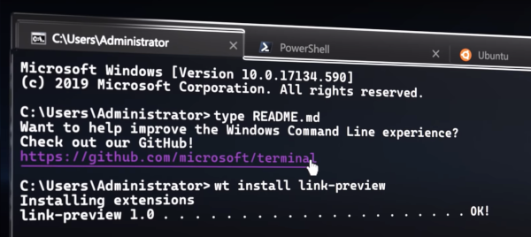

# Powershell Settings
Apenas um local para eu me lembrar como reconfigurar meu powershell sempre que preciso


## Windows Terminal
 

Primeiro vamos falar do Windows Terminal, que é uma especie de IDE agregadora de terminais. Com ele é possível abrir múltiplas abas de terminais distintos como o *Command Prompt* e o próprio *Powershell*, além dos ambientes linux com o *WSL*. Instale o Windows Terminal através desse [link](https://www.microsoft.com/en-us/p/windows-terminal-preview/9n0dx20hk701?activetab=pivot:overviewtab) da Windows Store.  

### Background
Pra definir uma imagem, com transparência, como fundo da tela, abra as configurações do windows terminal com `ctrl`+`,` e adicione as seguintes tags ao perfil desejado: 
```json 
   "backgroundImage": "ms-appdata:///roaming/Matrix1920.gif",
   "backgroundImageOpacity": 0.15,
   "backgroundImageStretchMode": "uniformToFill",
```

  

A imagem a ser usada para o fundo precisa ser disponibilizada dentro do *sandbox* em que o windows terminal tem acesso e é descrita por esse prefixo `ms-appdata:///roaming/`.  Copie a imagem disponibiliza [nesse repositório](./backgrounds/Matrix1920.gif) (ou a sua imagem de preferência), para a seguinte pasta: `%LOCALAPPDATA%\Packages\Microsoft.WindowsTerminal_8wekyb3d8bbwe\RoamingState`.   


## Powershell Core
O Windows 10 já possui o Powershell 5.1 [instalado por padrão](https://docs.microsoft.com/pt-br/powershell/scripting/windows-powershell/install/installing-windows-powershell?view=powershell-7), e isso via de regra é suficiente. Porém o powershell foi re-escrito como uma ferramenta opensource e multiplataforma, chamado agora de [Powershell Core](https://github.com/PowerShell/PowerShell). Para instalá-lo, basta acessar a página de releases, baixar o msi para sua arquitetura e executar.  
Opcionalmente, vou deixar aqui um [script](https://www.thomasmaurer.ch/2019/07/how-to-install-and-update-powershell-7/) que tem por objetivo identificar a versão necessária e baixar o instalador:
``` powershell
iex "& { $(irm https://aka.ms/install-powershell.ps1) } -UseMSI"
```
O mesmo script poderá ser executado posteriormente para baixar as atualizações.


## Posh-Git
O [posh-git](https://github.com/dahlbyk/posh-git) é um módulo do PowerShell que integra o *Git* ao Powershell provendo informações de status e contexto do Git que pode ser exibido diretamente no prompt de comando. Além de disponibilizar autocomplete para os comandos Git, nomes de branch, e muito mais.  

### Instalação 
Para instalar o módulo execute o seguinte comando:
``` powershell
Install-Module posh-git -Scope CurrentUser
```
Pode ser necessário autorizar pacotes vindos da *Galeria do Powershell*. Responda sim para que a instalação prossiga.  
Se voce receber um erro de *Install-Module* sobre o NuGet precisando interagir com *Repositório NuGet*, execute os comandos a seguir para inicializar o provedor de Nuget:
``` powershell
Install-PackageProvider NuGet -Force
Import-PackageProvider NuGet -Force
```

### Atualizações
Depois de instalado, você poderá sempre atualizar o módulo através do comando: 
``` powershell
Update-Module posh-git
``` 

### PSReadline
Se você estiver utilizando o Powershell Core, será preciso instalar o módulo [PSReadline](https://docs.microsoft.com/en-us/powershell/module/psreadline/?view=powershell-6&WT.mc_id=-blog-scottha) para poder customizar o ambiente do prompt de commando no Powershell. Isso pode ser feito através do comando:
``` powershell
Install-Module -Name PSReadLine -AllowPrerelease -Scope CurrentUser -Force -SkipPublisherCheck
``` 

## Oh-My-Posh
Até aqui já seria possível usufruir das funcionalidades que o posh-git traz e até mesmo escrever o seu prório *tema* para o prompt de comando seguindo a documentação. Mas para facilitar um pouco mais, vamos instalar o módulo [oh-my-posh](https://github.com/JanDeDobbeleer/oh-my-posh) que, basicamente, disponibiliza deversos desses temas, já prontos para uso. 

### Instalação
Instalaremos o módulo com o comando:
``` powershell
Install-Module oh-my-posh -Scope CurrentUser
``` 

## Profile
Sempre que abrir uma sessão do PowerShell, será preciso *ativar* os módulos que deseja usar, a saber o *posh-git* e/ou *oh-my-posh*. Para fazer essa ativação automaticamente, vamos editar o arquivo do seu perfil do Powershell e preencher com os comandos que desejamos executar sempre que iniciarmos uma sessão. 

### Editar o Perfil
Vamos abrir o arquivo do perfil com o comando:
``` powershell
code $PROFILE
``` 
E então, simplesmente adicione as seguintes linhas:
``` powershell
Import-Module posh-git
Import-Module oh-my-posh
Set-Theme Paradox
``` 
Salve o arquivo e pronto. Novas sessões já serão inicializadas com os módulos carregados e o tema *Paradox* ativado. 

### Ajustar o Encoding
Quando começar a executar comandos git e visualizar logs de commits, possivelmente encontrará comentários utilizndo acentuações. Para que o terminal os exiba corretamente, vamos editar novamente o arquivo do perfil com: `code $PROFILE`, e acrescentar a seguinte linha:
``` powershell
$env:LC_ALL='C.UTF-8'
``` 

### Ocultar o usuário
Por padrão o usuário corrente será exibido como parte do prompt de comando. Para ocultá-lo precisamos preencher a variável que indica quem é o usuário padrão. Os temas verificam se o usuário corrente for o definido nessa variável e em caso afirmativo não o exibe. Vamos editar mais uma vez o arquivo do perfil com: `code $PROFILE`, e acrescentar a seguinte linha:
``` powershell
$DefaultUser = '{substitua com o seu nome de usuário}'
``` 

### Definir mensagem
Por fim, para sempre começar com uma tela limpa vamos editar o perfil com: `code $PROFILE`, e acrescentar a seguinte linha:
``` powershell
Clear-Host
Write-Host "Olá... foco no código"
``` 

## Fonte
Os temas utilizados podem precisar de uma fonte que tenha suporte a *glyphos* e *ligaduras*. Uma boa sugestão é a [Cascadia Code](https://github.com/microsoft/cascadia-code) que é opensource e tem o suporte necessário à *[Powerline](# https://docs.microsoft.com/pt-br/windows/terminal/tutorials/powerline-setup)*.  
Basta acessar a área de release do repositório e baixar a versão *Cascadia Code PL*. Adicionalmente estou disponibilizando [aqui](./fonts/CascadiaCodePL.ttf) a última versão que usei. Após baixar, clique na mesma com o botão direito e selecione *instalar*.  
Na sequencia, abra as configurações do windows terminal com `ctrl`+`,` e adicione a seguinte tag ao perfil desejado:
``` json
   "fontFace":  "Cascadia Code PL"
```

## Temas disponibilizados
Os temas disponíveis podem ser consultados [aqui](https://github.com/JanDeDobbeleer/oh-my-posh#themes).

#### Agnoster


#### Paradox


#### Sorin


#### Darkblood


#### Avit


#### Honukai


#### Fish


#### Robbyrussell


#### Pararussel


#### Material


#### Star


#### Zash


#### Lambda


## Tema Customizado
Os temas disponibilizados pelo módulo *oh-my-posh* nada mais são que um arquivo de script com instruções e comandos dispobilizados pelo módulo *posh-git*. Partindo como exemplo do tema [Honukai](https://github.com/JanDeDobbeleer/oh-my-posh/blob/master/Themes/Honukai.psm1) e seguindo a [documentação](https://github.com/dahlbyk/posh-git#git-status-summary-information), fiz algumas adequações para compor um tema que mais me agradasse e o estou disponibilizando [aqui](./themes/Elesse.psm1).  

### Ativação
Para ativar esse tema, editar o perfil com: `code $PROFILE` e mencionar o caminho completo onde o gravou, como:
``` powershell
Set-Theme C:\Sources\Personal\powershell-settings\themes\Elesse.psm1
```
Opcionalmente, seria possível disponibilizar esse tema na pasta de temas do *oh-my-posh* que normalmente se encontra em: `C:\Users\{seu nome de usuario}\Documents\PowerShell\Modules\oh-my-posh`

## Conclusão
Seu terminal não precisa ser boring.
