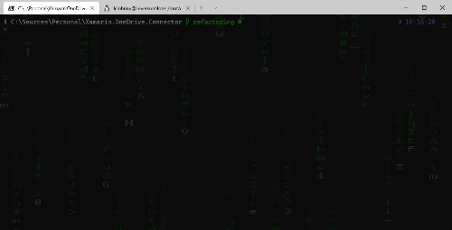

# Introdução
Apenas um local para eu me lembrar como reconfigurar meu windows terminal do jeito que gosto e preciso. 

# Powershell Core
O Windows 10 já possui o Powershell 5.1 instalado por padrão e isso, via de regra, seria suficiente. Porém o powershell foi re-escrito como uma ferramenta opensource e multiplataforma, chamado agora de [Powershell Core](https://github.com/PowerShell/PowerShell). A forma mais fácil de instalá-lo é através da [Microsoft Store](https://www.microsoft.com/store/productId/9MZ1SNWT0N5D), com isso as atualizações serão aplicadas automaticamente. 


# Profile
Sempre que uma instância do powershell é iniciada o script do perfil é executado. Então ali é o local para se colocar as definições que queremos sempre ativas.  
O caminho completo para esse script pode ser obtido através da variável `$PROFILE`. Então, ao longo dos próximos passos vamos adicionar algum conteúdo a esse script.  
Vamos começar com a definição do encoding. Quando começar a executar commits e visualizar logs, possivelmente encontrará comentários utilizando acentuações. Para que o terminal os exiba corretamente, abra o script para edição com o comando `code $PROFILE` e adicione as seguintes linhas:
```ps1
$env:LC_ALL='C.UTF-8'
```


# Git
Fazer o download e executar o pacote de instalação através do [site oficial](https://git-scm.com). Logo após, registrar o usuário e email que será associado aos commits com os seguintes comandos:
```ps1 
git config --global user.name "Seu Nome"
git config --global user.email "seuEmail@seuProvedor.com"
```
## Git Credential Manager
A instalação do [visual studio](https://visualstudio.microsoft.com/pt-br) já fará a instalação do [Git Credential Manager](https://github.com/Microsoft/Git-Credential-Manager-for-Windows) que será responsável pela autenticação nos repositórios.  
O processo deverá acontecer automaticamente ao fazer o primeiro `git push`, solicitando autenticação através do navegador.


# Git Aliases
Esse módulo vai prover aliases para comandos Git baseados no pluging [Oh My Zsh](https://github.com/ohmyzsh/ohmyzsh/tree/master/plugins/git).  
Rode o seguinte comando para instalar o módulo no powershell: 
```ps1
Install-Module -Name git-aliases
```
Para ativar o módulo, editar seu perfil com: `code $PROFILE` e adicionar a seguinte linha:
```ps1
Import-Module git-aliases -DisableNameChecking
```
Posteriormente, para atualizar o módulo quando houver atualizações, rode o comando:
```ps1
Update-Module git-aliases
```
## Aliases
Abaixo, alguns dos aliases que serão disponibilizados. A lista completa pode ser consultada no [repositório do plugin](https://github.com/ohmyzsh/ohmyzsh/tree/master/plugins/git).
| Alias                | Command                                                                                                                          |
|:---------------------|:---------------------------------------------------------------------------------------------------------------------------------|
| g                    | git                                                                                                                              |
| ga                   | git add                                                                                                                          |
| gb                   | git branch                                                                                                                       |
| gbl                  | git blame -b -w                                                                                                                  |
| gc                   | git commit -v                                                                                                                    |
| gcmsg                | git commit -m                                                                                                                    |
| gco                  | git checkout                                                                                                                     |
| gcm                  | git checkout $(git_main_branch)                                                                                                                |
| gcd                  | git checkout develop                                                                                                             |
| gd                   | git diff                                                                                                                         |
| gdw                  | git diff --word-diff                                                                                                             |
| gf                   | git fetch                                                                                                                        |
| gfa                  | git fetch --all --prune                                                                                                          |
| gfo                  | git fetch origin                                                                                                                 |
| gl                   | git pull                                                                                                                         |
| ggl                  | git pull origin $(current_branch)                                                                                                |
| gp                   | git push                                                                                                                         |
| ggp                  | git push origin $(current_branch)                                                                                                |
| gpsup                | git push --set-upstream origin $(git_current_branch)                                                                             |
| glg                  | git log --stat                                                                                                                   |
| glo                  | git log --oneline --decorate                                                                                                     |
| glog                 | git log --oneline --decorate --graph                                                                                             |
| gloga                | git log --oneline --decorate --graph --all                                                                                       |
| gm                   | git merge                                                                                                                        |
| grb                  | git rebase                                                                                                                       |
| gss                  | git status -s                                                                                                                    |
| gst                  | git status                                                                                                                       |
| gts                  | git tag -s                                                                                                                       |


# Oh-My-Posh
O [Oh-My-Posh](https://ohmyposh.dev) é um engine de temas para o prompt, criado sob inspiração do [Oh-My-Zsh](https://ohmyz.sh).  

Instalaremos o módulo com o comando:
```ps1
Install-Module oh-my-posh -Scope CurrentUser
``` 

E vamos ativá-lo, editando o perfil com: `code $PROFILE` e adicionar a seguinte linha:
```ps1
Import-Module oh-my-posh -DisableNameChecking
```

Uma série de [temas](https://github.com/JanDeDobbeleer/oh-my-posh/tree/main/themes) serão disponibilizados e podem ser consultados com o comando:  
```ps1
Get-PoshThemes
```

Para ativar o tema desejado (agnoster, no exemplo), edite o perfil com: `code $PROFILE` e adicione a seguinte linha:
```ps1
Set-PoshPrompt -Theme agnoster
```

Adicionalmente, poderíamos seguir a [documentação](https://ohmyposh.dev/docs/configure) e escrever um tema personalizado. Eu tomei o tema paradox como exemplo, fiz pequenos ajustes e disponibilizei [aqui](./themes/custom-paradox.omp.json). Para ativá-lo devemos mencionar o caminho completo, por exemplo:
```ps1
Set-PoshPrompt -Theme Set-PoshPrompt -Theme c:\MyWindowsTerminal\themes\custom-paradox.omp.json
```


# Mensagem de apresentação
Novas instâncias do powershell são apresentadas com as boas vindas do powershell. Prefiro limpar a tela e apresentar algumas instruções que podem ser mais úteis como no exemplo abaixo. Para isso, editar o perfil com: `code $PROFILE`, e acrescentar as seguintes linhas:
```ps1
cd \Sources
Clear-Host
Write-Host 'PowerShell:'
Write-Host ' => '($PSVersionTable.PSVersion.Major,$PSVersionTable.PSVersion.Minor,$PSVersionTable.PSVersion.Patch -join ".")
Write-Host 'Profile:'
Write-Host ' => code $PROFILE'
Write-Host "Themes:"
Write-Host ' => Get-PoshThemes'
Write-Host ''
``` 


# Windows Terminal

 

Por fim vamos falar do Windows Terminal, que é uma especie de IDE agregadora de terminais. Com ele é possível abrir múltiplas abas de terminais distintos como o *Command Prompt* e o próprio *Powershell*, além dos ambientes linux com o *WSL*. Instale o Windows Terminal através desse [link](https://www.microsoft.com/store/productId/9N0DX20HK701) da Windows Store.  

## Background
Pra definir uma imagem, com transparência, como fundo da tela, abra as configurações do windows terminal com `ctrl`+`,` e adicione as seguintes tags ao perfil desejado: 
```json 
   "backgroundImage": "ms-appdata:///roaming/Matrix1920.gif",
   "backgroundImageOpacity": 0.15,
   "backgroundImageStretchMode": "uniformToFill",
```

A imagem a ser usada para o fundo precisa ser disponibilizada dentro do *sandbox* em que o windows terminal tem acesso e é descrita por esse prefixo `ms-appdata:///roaming/`.  
Copie a imagem disponibilizada [aqui](./backgrounds/Matrix1920.gif) (ou a sua imagem de preferência), para a seguinte pasta: `%LOCALAPPDATA%\Packages\Microsoft.WindowsTerminal_8wekyb3d8bbwe\RoamingState`.   


## Fonte
Vamos precisar de uma fonte que tenha suporte a *glyphos* e *ligaduras*. O portal [NerdFonts](https://www.nerdfonts.com) possui uma boa biblioteca de fontes com diversas opções. Eu costumo alternar entre essas: 
- [FiraCode NF](https://github.com/ryanoasis/nerd-fonts/releases/download/v2.1.0/FiraCode.zip)
- [MesloLGSDZ NF](https://github.com/ryanoasis/nerd-fonts/releases/download/v2.1.0/Meslo.zip)  
- [Cascadia Code PL](https://github.com/microsoft/cascadia-code)

Basta fazer o download, abrir o pacote, clicar com o botão direito e selecionar *instalar*.  

Para ativar, abra as configurações do windows terminal com `ctrl`+`,` e adicione a seguinte tag ao perfil desejado (ou na sessão `defaults` para refletir a todos os perfis):
``` json
   "fontFace":  "FiraCode NF"
```


# Linux no Windows

## Ativação
Para ativar o subsistema linux para windows, basta seguir o [tutorial oficial](https://docs.microsoft.com/pt-br/windows/wsl/install-win10), mas basicamente iremos:
- Usando o menu iniciar, pesquisar por `ativar ou desativar recursos do windows`
- Marcar as opções `plataforma de máquina virtual` e `subsistema do windows para linux`
- Após instalação desses recursos, atualizar o wsl1 para wsl2 com [esse pacote de atualização](https://wslstorestorage.blob.core.windows.net/wslblob/wsl_update_x64.msi), ou [consultar a 4a etapa](https://docs.microsoft.com/pt-br/windows/wsl/install-win10#step-4---download-the-linux-kernel-update-package) do tutorial para outras opções.
- Definir a versão padrão do wsl para o wsl2 com o seguinte comando: 
  ```ps1
  wsl --set-default-version 2
  ```
- Será possível conferir a versão corrente com o seguinte comando:
  ```ps1
  Get-ItemPropertyValue `
     -Path HKCU:\SOFTWARE\Microsoft\Windows\CurrentVersion\Lxss `
     -Name DefaultVersion
  ``` 
- Instalar [uma das distribuição linux](https://aka.ms/wslstore) através da loja. Os próximos passos levarão em conta o Ubuntu
- Utilizando o menu iniciar, executar a primeira vez a distribuição instalada para concluir o processo
  - Será criado usuário com senha
  - Será criado perfil no windows terminal

