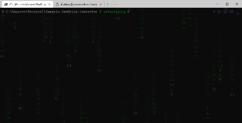

# Windows Terminal

- [Apresentação](#apresentação)
- [Fonte](#fonte)
- [Background](#background)


## Apresentação
 
O Windows Terminal é uma especie de IDE agregadora de terminais. Com ele é possível abrir múltiplas abas de terminais distintos como o *Command Prompt* e o próprio *Powershell*, além dos ambientes linux com o *WSL*. Instale o Windows Terminal através desse [link](https://www.microsoft.com/store/productId/9N0DX20HK701) da Windows Store.  

## Fonte
Vamos precisar de uma fonte que tenha suporte a *glyphos* e *ligaduras*. O portal [NerdFonts](https://www.nerdfonts.com) possui uma boa biblioteca de fontes com diversas opções. Eu costumo alternar entre essas: 
- [FiraCode NF](https://github.com/ryanoasis/nerd-fonts/releases/download/v2.1.0/FiraCode.zip)
- [MesloLGSDZ NF](https://github.com/ryanoasis/nerd-fonts/releases/download/v2.1.0/Meslo.zip)  
- [Cascadia Code PL](https://github.com/microsoft/cascadia-code)

Basta fazer o download, abrir o pacote, clicar com o botão direito e selecionar *instalar*.  

Para ativar, abra as configurações do windows terminal com `ctrl`+`,` e adicione a seguinte tag ao perfil desejado (ou na sessão `defaults` para refletir a todos os perfis):
``` json
   "fontFace":  "FiraCode NF"
```


## Background
Pra definir uma imagem, com transparência, como fundo da tela, abra as configurações do windows terminal com `ctrl`+`,` e adicione as seguintes tags ao perfil desejado (ou na sessão `defaults` para refletir a todos os perfis): 
```json 
   "backgroundImage": "ms-appdata:///roaming/Matrix1920.gif",
   "backgroundImageOpacity": 0.15,
   "backgroundImageStretchMode": "uniformToFill",
```
A imagem a ser usada para o fundo precisa ser disponibilizada dentro do *sandbox* em que o windows terminal tem acesso e é descrita por esse prefixo `ms-appdata:///roaming/`.  
Copie a imagem disponibilizada [aqui](./Matrix1920.gif) (ou a sua imagem de preferência), para a seguinte pasta: `%LOCALAPPDATA%\Packages\Microsoft.WindowsTerminal_8wekyb3d8bbwe\RoamingState`.   

